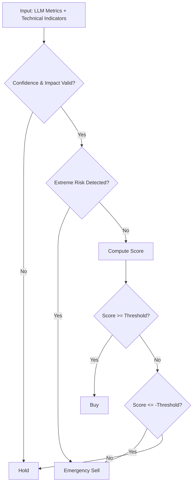

# Team XX - Crypto Trading Strategy

## Team Members

Team 7
Gafarova Renata
Jeanpaul Elezaveta
Zinovyeva Ksenia
Ivanov Alexander

---

## Strategy Overview

Our strategy combines **LLM-based news signal extraction** with a **risk-aware scoring trading model**.

The LLM is used strictly for structured feature extraction from news, while the final trading decision is made by a quantitative scoring engine that integrates:

* News sentiment
* Market impact
* Regulatory risk
* Technical indicators (RSI, MACD, Bollinger Bands)
* Volatility filters

The main objective is to maximize **Sharpe Ratio** by reducing unnecessary trades and preventing large drawdowns.

---

## LLM Metrics Design

### Extracted Metrics:

* **sentiment_score (-1..1)**
  Measures directional tone of the news toward the specific cryptocurrency.

* **news_impact (0..1)**
  Estimates how significant the event is (major announcement vs noise).

* **regulatory_risk (0..1)**
  Captures potential negative regulatory or legal risks.

* **adoption_signal (0..1)**
  Measures positive long-term fundamental developments (ETF, partnerships, institutional adoption).

* **event_type (categorical)**
  regulation | adoption | hack | partnership | macro | neutral
  Used to bias scoring logic.

* **volatility_risk (0..1)**
  Estimates probability of abnormal price swings after the event.

* **confidence (0..1)**
  Model confidence in extracted signals. Used for signal scaling.

---

### Design Philosophy

We intentionally separated **signal extraction (LLM)** from **decision making (trading logic)**.

The LLM does not decide buy/sell directly. Instead, it produces structured quantitative signals.
This reduces overfitting and avoids emotional or heuristic-based trading decisions.

Our design prioritizes:

* Risk control
* Stability
* Fewer but higher-quality trades

---

## Business Logic Design

### Strategy Type:

**Hybrid (Scoring + Rule-based Risk Management)**

---

### Core Decision Rules:

**1. Risk Filters (No Trade Conditions)**
IF confidence < 0.35 OR news_impact < 0.20
→ HOLD

IF volatility_risk > 0.85 OR volatility_7d > 0.08
→ HOLD

---

**2. Emergency Exits**
IF RSI ≥ 88
→ SELL

IF regulatory_risk ≥ 0.85 AND news_impact ≥ 0.5
→ SELL

IF event_type == "hack" AND news_impact ≥ 0.4
→ SELL

---

**3. Scoring Model**

Score is computed as:

Score =
(confidence_adjusted_sentiment × weight)

* (adoption_signal × weight)
* (MACD contribution)
* (RSI normalization)
  − (regulatory_risk penalty)
  − (volatility penalties)

Decision:

* IF Score ≥ BUY_THRESHOLD → BUY
* IF Score ≤ SELL_THRESHOLD → SELL
* ELSE → HOLD

Thresholds are tuned to balance trade frequency and drawdown.

---

### Decision Flowchart

---

## Risk Management

**Max position size:** 100% of available capital per signal

**Stop-loss condition:**

* RSI ≥ 88
* High regulatory risk with strong impact
* High-impact hack events

**Trade frequency limit:**
Indirectly controlled by:

* Confidence filter
* News impact filter
* Volatility filter

Target trade range: 20–80 trades over 90 days.

---

## Backtest Results

| Metric       | Value |
| ------------ | ----- |
| Sharpe Ratio | TBD   |
| Total Return | TBD   |
| Max Drawdown | TBD   |
| Win Rate     | TBD   |
| Total Trades | TBD   |

---

## Analysis

### What worked:

* Confidence-weighted sentiment reduced false signals
* Volatility filters significantly reduced drawdown
* Emergency exits protected against extreme overbought conditions

### What didn't work:

* Overly strict filters resulted in too few trades
* High thresholds initially suppressed performance
* LLM confidence variability affected trade frequency

---

### Key Learning:

Separating structured news interpretation from trading decision logic improves robustness and risk-adjusted performance.

A well-calibrated filtering layer is critical for maximizing Sharpe Ratio.

---

## 🏆 Evaluation

### Sharpe Ratio Formula:

$$
\text{Sharpe Ratio} = \frac{\text{Avg Daily Return}}{\text{Std Dev of Returns}} \times \sqrt{365}
$$

**What it measures:**
Risk-adjusted return (higher = better)

Example:

* Strategy A: +50% return, 5% volatility → Sharpe = 10.0
* Strategy B: +100% return, 60% volatility → Sharpe = 1.67

---

### Ranking Process:

1. Instructor clones all repositories at 21:00
2. Runs `workflow.json` on same dataset
3. Calculates Sharpe Ratio from `trades_log.csv`
4. Ranks teams

Tie-breakers: Lower drawdown → Higher return

---

## 🚨 Rules

### Allowed:

* Modify only the 2 designated nodes
* Use provided indicators
* Test multiple approaches
* Discuss ideas with other teams

### Prohibited:

* External data sources
* Modifying other nodes
* Plagiarism
* Hard-coded date-specific rules
* Late submission

---

## 💡 Tips

### For High Sharpe Ratio:

1. Prevent large losses
2. Reduce volatility
3. Trade less, but trade better

### Common Mistakes:

* Letting LLM decide buy/sell directly
* Too many extracted metrics
* No risk management
* Overfitting

### Quick Sanity Check:

* Baseline Sharpe ≈ 0.5–1.0
* Negative Sharpe → Logic likely broken
* Sharpe > 3.0 → Check for overfitting

---

## ❓ FAQ

**Q: Can we make repository private?**
A: No. It must be public.

**Q: What if we push after 21:00?**
A: Only commits before deadline are evaluated.

**Q: Required files?**
A: README.md, workflow.json, trades_log.csv.

**Q: Starting capital?**
A: $10,000. Transaction fee: 0.1% per trade.

---

**Best strategy wins. Submit GitHub link before deadline. 🚀**
